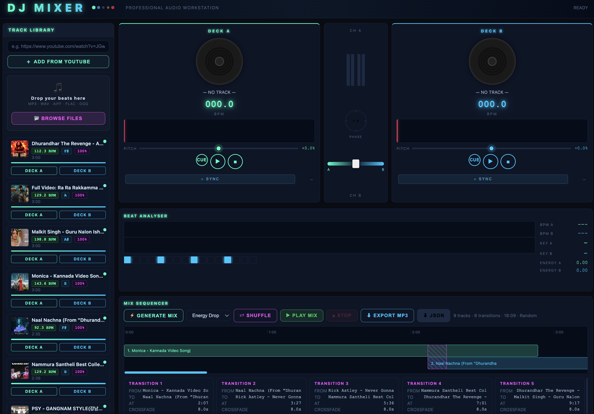

# DJ Mixer

A browser-based professional DJ workstation. Add tracks from YouTube or upload your own audio, analyze BPM and energy, mix on dual decks, and generate smart automated mix sequences — all in one self-contained web app.




---

## Features

### Track Library
- Add tracks by pasting a **YouTube URL** — audio is downloaded and cached locally
- **Upload your own beats** (MP3, WAV, AIFF, FLAC, OGG)
- Automatic **BPM, key, and energy analysis** via librosa
- **BPM match highlighting** — green (within 2%), yellow (within 8%) when a deck is playing
- Tracks persist across sessions (server cache + localStorage)

### Dual Decks
- **Deck A & B** with waveform display, playhead, and click/drag to seek
- Pitch slider (±8%) with live BPM readout
- **Beat sync** — auto-aligns phase when starting a deck while the other is playing
- Crossfader with **VU meters** that rise and fall together on the beat
- Phase alignment meter between decks

### Scratch & Effects
- **Scratch pad** — drag the vinyl with mouse or touchpad for rate modulation
- Effects: **Echo, Flanger, Filter, Stutter, Reverse** with wet/dry and rate controls

### Mix Sequencer
- **Generate Mix** — automatically orders and sequences all analyzed tracks
- **5 ordering strategies:**
  - BPM Flow — greedy nearest-neighbour BPM matching (smoothest transitions)
  - Energy Build — quiet to hype
  - Energy Drop — high energy opener, winds down
  - BPM Climb — ascending tempo throughout set
  - Random — shuffle
- **⇄ Shuffle** — instantly regenerate a new random sequence from the same tracks
- Smart **intro skip** — detects first beat and snaps to phrase boundary
- Smart **transition points** — finds energy drops at phrase boundaries for clean exits
- **Crossfade** with configurable duration per transition (8–24 s based on energy)
- Horizontal scrollable **timeline** — click any track block to play from that point
- **Playback rate matching** between adjacent tracks (±8% BPM stretch)

### Saved Mixes
- Every generated mix is **auto-saved** as a self-contained JSON file in `mixes/`
- Each file includes YouTube URLs so the mix is **playable from any machine**
- **Load** any saved mix back into the sequencer
- **Rename** mixes inline (click the name)
- **Delete** mixes you no longer need

### Export
- **Export MP3** — renders the full mix to a single MP3 via ffmpeg with crossfades applied
- **Export JSON** — save the raw mix plan for later use or sharing

---

## Requirements

- Python 3.10+
- Node.js (for yt-dlp JavaScript runtime)
- ffmpeg (for audio conversion and MP3 export)

---

## Setup

```bash
# Clone
git clone git@github.com:girishsk/dj-mixer.git
cd dj-mixer

# Create virtual environment
python3 -m venv venv
source venv/bin/activate

# Install dependencies
pip install -r requirements.txt

# Start the server
python app.py
```

Open **http://localhost:8080** in your browser.

---

## Project Structure

```
dj-mixer/
├── app.py              # Flask backend — analysis, mix generation, export
├── templates/
│   └── index.html      # Single-page app (CSS + JS inline)
├── static/             # Static assets
├── cache/              # Downloaded audio + analysis JSON (git-ignored)
├── mixes/              # Saved mix plans as JSON
├── requirements.txt
└── start.sh
```

---

## Stack

| Layer | Technology |
|---|---|
| Backend | Python / Flask |
| Audio download | yt-dlp |
| Audio analysis | librosa, numpy |
| Audio rendering | ffmpeg |
| Frontend | Vanilla JS + Web Audio API |
| Waveforms | Canvas 2D API |
| Persistence | JSON files (mixes/) + localStorage |
